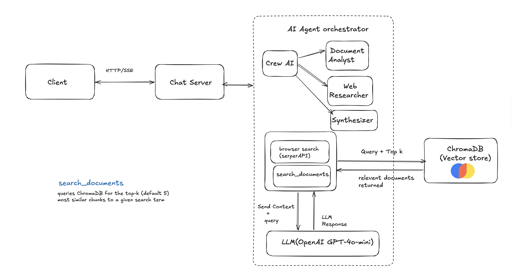

# DocChat

A RAG (Retrieval-Augmented Generation) chatbot that answers questions about your documents, backed by a multi-agent CrewAI pipeline that combines document search with live web search.

**Stack:** OpenAI · LangChain · ChromaDB · CrewAI · FastAPI · React/Vite · Docker



## Ingesting documents

Documents can be uploaded directly from the UI sidebar (PDF, TXT, Markdown — up to 10 MB, 10,000 words).

To ingest from the command line (while the container is running):

```bash
docker compose exec app python -m backend.ingest data/sample.txt
docker compose exec app python -m backend.ingest --clear data/sample.txt   # wipe and re-ingest
```

| Flag           | Default | Description                           |
| -------------- | ------- | ------------------------------------- |
| `--chunk-size` | `1000`  | Characters per chunk                  |
| `--overlap`    | `200`   | Overlapping characters between chunks |
| `--clear`      | —       | Wipe all chunks before ingesting      |

Documents are split using LangChain's `RecursiveCharacterTextSplitter` (respects paragraph → sentence → word boundaries), embedded with `text-embedding-3-small`, and stored in ChromaDB. Files already in the store are skipped automatically.

---

## How it works

### Full pipeline

Profanity check — First, your message is scanned for inappropriate content. If it's flagged, you get a rejection and nothing else happens.

Response cache — The system checks if it has already answered this exact (or very similar) question before. If yes, it just replays that answer instantly — no AI needed.

History relevance check — It looks at your recent conversation and asks: "is this a follow-up to what we were just talking about, or a brand new topic?" It uses a math score (cosine similarity) to decide.

If it's a follow-up (score ≥ 0.65), it rewrites your question to include context from earlier in the chat (e.g. "it" becomes "the uploaded PDF").
If it's a new topic, your original message is used as-is.
Retrieval — It searches your uploaded documents (stored in ChromaDB) for relevant chunks:

If you mentioned a filename, it fetches all chunks from that file in order.
Otherwise, it grabs the top 6 most semantically similar chunks.
Routing decision — Based on what was found, it decides which AI agents to use:

Docs found and sufficient → Document Analyst + Synthesizer
Docs found but not enough → Document Analyst + Web Researcher + Synthesizer (also searches the web)
No docs at all → Web Researcher + Synthesizer (pure web search)
CrewAI agents run — The chosen agents work sequentially and stream their response back to you in real time.

commit() — The conversation turn is saved: chat history, a SQLite record, and the response is stored in cache for next time.

### Agents

**📄 Document Analyst** — searches the vector store with multiple query terms using a custom CrewAI tool that wraps ChromaDB. Never fabricates — reports what the documents say or states they don't cover the topic.

**🌐 Web Researcher** — calls Google Search via SerperDevTool. Finds 2–3 sources and includes a URL for every fact.

**🔀 Synthesizer** — no tools. Combines agent outputs into a structured response with explicit attribution (`📄 From your documents` / `🌐 From Google Search`) and 3 follow-up suggestions.

### Caching

Four layers of caching to avoid redundant API calls:

| Cache             | Key                                     | Entries         | Invalidated when        |
| ----------------- | --------------------------------------- | --------------- | ----------------------- |
| Response cache    | `normalized_message \| doc_fingerprint` | 128 (LRU)       | Documents added/removed |
| Sufficiency check | MD5 of `(question, context)`            | 256 (LRU)       | Never (deterministic)   |
| Vector search     | `(query, k)`                            | 128 (LRU)       | Documents added/removed |
| Embedding         | `text`                                  | 512 (lru_cache) | Process restart         |

---

## API endpoints

### Read

| Endpoint                      | Purpose                                       |
| ------------------------------ | ---------------------------------------------- |
| `GET /api/history?session_id=` | Fetch persisted conversation for a session     |
| `GET /api/status`              | Total ingested chunk count                     |
| `GET /api/budget`              | Today's token usage vs. daily limit            |
| `GET /api/documents`           | List ingested source files + chunk counts      |
| `GET /api/models`              | Available chat models                          |
| `GET /api/files/{filename}`    | Serve raw uploaded file content                |

### Edit

| Endpoint                                  | Purpose                                     |
| ------------------------------------------ | -------------------------------------------- |
| `POST /api/chat`                           | Send message, stream RAG response (SSE)     |
| `POST /api/reset?session_id=`              | Clear a session's conversation history      |
| `POST /api/history/rollback?session_id=`   | Remove orphaned last user turn              |
| `POST /api/upload`                         | Ingest a new document (multipart file)      |
| `DELETE /api/documents/{filename}`         | Remove a document + its chunks              |
| `POST /api/stt`                            | Transcribe recorded audio → text            |
| `POST /api/tts`                            | Synthesize text → audio                     |
| `POST /api/payments/subscribe`             | Sandbox: grant Pro tier                     |

## Design decisions

### OpenAI for everything

All LLM calls (query rewriting, sufficiency check, agents) and embeddings use OpenAI (`gpt-4o-mini` and `text-embedding-3-small`). Ollama was removed — no local model server needed.

### Streaming via SSE

Agent status updates and response text both stream over Server-Sent Events. The CrewAI crew runs in a background thread and pushes updates to a `queue.Queue`; the SSE generator drains the queue live, so users see which agent is working before the final answer arrives.

### Structured JSON logging

Every HTTP request and chat completion is logged as newline-delimited JSON, including `first_token_ms` and `total_stream_ms` for latency visibility. Pipe directly into any log aggregator without a parsing step.

### Daily token budget

A hard cap on OpenAI token usage resets every day at midnight. Set the limit in `.env`:

```
DAILY_TOKEN_LIMIT=100000   # default: 100,000 tokens/day
```

Once the limit is hit, chat requests return a message instead of calling OpenAI. Token counts are captured across all LangChain and CrewAI agent calls using `get_openai_callback()`, with context propagated into background threads via `contextvars.copy_context()`.

Check current usage at any time:

```
GET /api/budget
→ { "tokens_used": 4821, "daily_limit": 100000, "remaining": 95179, "date": "2026-05-19" }
```

## Cost considerations

All LLM calls use `gpt-4o-mini` ($0.15/1M input tokens, $0.60/1M output tokens). Embeddings use `text-embedding-3-small` ($0.02/1M tokens — negligible).

**Per request:** a typical chat turn (query rewriting + sufficiency check + up to 3 CrewAI agents) uses roughly 5,000–10,000 tokens, costing ~$0.002–0.004.

**To stay under $2/month** with daily use, set:

```
DAILY_TOKEN_LIMIT=200000
```

This allows ~20–25 requests/day and caps spend at ~$1.50–1.80/month at worst. The budget resets at midnight and is visible at `GET /api/budget`.

| Daily limit | Max requests/day | Approx monthly cost |
| ----------- | ---------------- | ------------------- |
| `50000`     | ~5–8             | ~$0.45              |
| `100000`    | ~10–15           | ~$0.90              |
| `200000`    | ~20–25           | ~$1.80              |

## License

MIT — see [LICENSE](LICENSE) for details.
